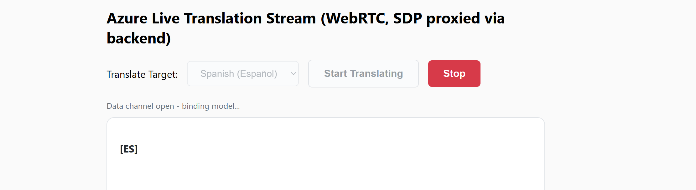

# Azure AI Foundry: Web App for Realtime Speech Translation via WebRTC

This repo demonstrates how to use the **gpt-realtime-translate** model in Microsoft Foundry with a server-side *WebRTC* SDP Proxy (in Python) and secure *Entra ID* authentication.

> [!CAUTION]
> This repo is provided to reproduce the observed issue. DON'T USE IT FOR YOUR LOCAL IMPLEMENTATION YET!!

## 📑 Table of Contents:
- [Part 1: Configuring Solution Environment](#part-1-configuring-solution-environment)
- [Part 2: Backend Implementation](#part-2-backend-implementation)
- [Part 3: Frontend UI](#part-3-frontend-ui)
- [Part 4: Running the Demo](#part-4-running-the-demo)

## Part 1: Configuring Solution Environment

### 1.1 Foundry Setup
Ensure you have a **gpt-realtime-translate** model deployed in your Microsoft Foundry resource. Take a note of your Foundry's resource name and your model's deployment name.

### 1.2 Authentication
The demo utilises passwordless *Microsoft Entra ID* authentication via the `DefaultAzureCredential` provider.

Before running the server locally, log in to your Azure environment using CLI command:

``` PowerShell
az login
```

> [!NOTE]
> Ensure the identity executing this code (your local *Azure CLI* login, *Service Principal* or *Managed Identity*) has been granted at least the **Foundry User** on your Azure AI resource, as described [here](https://learn.microsoft.com/en-us/azure/foundry/concepts/rbac-foundry?tabs=owner%2Cfoundry#minimum-role-assignments-to-get-started).

### 1.3 Environment Variables
Configure the following environment variables in your operating system:

| Environment Variable    | Description                                               |
| ----------------------- | --------------------------------------------------------- |
| FOUNDRY_RESOURCE_NAME   | The sub-domain name of your Foundry resource.             |
| FOUNDRY_DEPLOYMENT_NAME | The exact name of your gpt-realtime-translate deployment. |

### 1.4 Installation
Install the necessary Python packages:

``` Python
pip install fastapi uvicorn httpx azure-identity
```

## Part 2: Backend Implementation
The **app.py** file acts as an intermediate proxy between your client browser and Microsoft Foundry. This implementation utilises *WebRTC* instead of raw *WebSockets*, and enables a fallback authentication.

First, it obtains your *Entra ID* token:

``` Python
token_provider = get_bearer_token_provider(
    DefaultAzureCredential(),
    "https://cognitiveservices.azure.com/.default"
)
```

Rather than forcing the browser to manage API keys or ephemeral token paths, the backend exposes a single `/connect` route. When called, it loops through a matrix of session shapes (`mint_variants`) to fetch a short-lived token from Azure's GA endpoints:

``` Python
sdp_resp = await client.post(
    calls_url,
    headers={
        "Authorization": f"Bearer {ephemeral}",
        "Content-Type": "application/sdp",
    },
    content=sdp_offer,
)
```

This keeps your credentials on the server side and streams the negotiated SDP connection back to the client.

## Part 3: Frontend UI
The **static/index.html** file manages the native browser *WebRTC* handshake. Instead of raw downsampling and manual audio-chunk packetizing, WebRTC utilizes your browser's native media pipelines.

The application captures your microphone stream and binds it directly to the peer connection:

``` Python
mediaStream = await navigator.mediaDevices.getUserMedia({ audio: true });
mediaStream.getTracks().forEach(t => peerConnection.addTrack(t, mediaStream));
```

It establishes a WebRTC `RTCPeerConnection` and automatically pipes the remote translated voice track directly into an HTML5 `<audio>` element:

``` Python
peerConnection.ontrack = (event) => {
    audioElement.srcObject = event.streams[0];
};
```

Text transcripts are handled over an `oai-events` WebRTC data channel, appending translation deltas into your workspace on the fly:

``` Python
dataChannel.onmessage = (event) => {
    const data = JSON.parse(event.data);
    if (data.type === 'session.output_transcript.delta' && currentParagraphBlock) {
        currentParagraphBlock.appendChild(document.createTextNode(data.delta));
    }
};
```

## Part 4: Running the Demo

### 4.1 Launch the Server
Ensure that **index.html** file is nested inside the **static/** folder alongside your **app.py** execution layer. Then launch the local app's Python stack using your terminal:

``` PowerShell
python app.py
```

### 4.2 Test Live Translation
Open your web browser and enter the following URL:

``` Plaintext
http://localhost:8000/static/index.html
```

Select an output *translate target* from the *languages* drop-down list, click **Start Translating** and begin speaking. Click **Stop** to end the live audio session, clear the state and start a new distinct paragraph.


